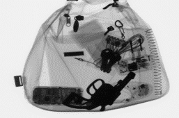

## **Object Detection - Identify harmful objects in X-Ray Image of Baggages**

## _Introduction of the MM811 Project_

In areas of high security, like airports, etc, X-Ray machines are used to scan baggage
to look for hazardous objects. But, in a manual scan, it is easy to miss some details.
Create a model to detect harmful/hazardous objects like razor blades/handguns in
X-Ray images of baggage.

The input size of the image is 300X300.

We will carry out object detection in images using SSD object detector with a ResNet50 neural network backbone.

## _Project Directory Structure_

```
│ Object_detection.ipynb
├───Input to be passed
│ knivesimage.jpg
│ scissors 1.jpg
| blades undetected 1.jpg
│ blades udectected 2.jpg
│
├───Output images obtained
│ knife.jpg
│ scissors.jpg
| blades1.jpg
| blade2.jpg
```

## _Implementation_

```

go to google colab and upload 811_project.ipynb
execute the code

```

_Note: Due to google colab issue with cv2.imshow we are using a special library for cv2.imshow()._

## _Explanation of the code_

_We have used a pre-trained SSD model, which was already trained on COCO dataset and hence with the help of Resnet50 by implementing transfer learning approach we used 200 images of GDXray dataset on top of our pre-trained model._

**Draw_boxes function**

The bounding boxes around the items in an image are drawn. Three parameters are sent to draw bboxes(). Image, results, and classes to labels are the three. Before any resizing or other augmentations/transforms, image is the original input picture or frame. The bounding box coordinates, labels, and confidence scores for the discovered items are included in the findings.

```
def draw_bboxes(image, results, classes_to_labels):
    for image_idx in range(len(results)):
        image = cv2.cvtColor(image, cv2.COLOR_RGB2BGR)
        # get the original height and width of the image to resize the ...
        # ... bounding boxes to the original size size of the image
        orig_h, orig_w = image.shape[0], image.shape[1]
        # get the bounding boxes, classes, and confidence scores
        bboxes, classes, confidences = results[image_idx]
        for idx in range(len(bboxes)):
            # get the bounding box coordinates in xyxy format
            x1, y1, x2, y2 = bboxes[idx]
            # resize the bounding boxes from the normalized to 300 pixels
            x1, y1 = int(x1*300), int(y1*300)
            x2, y2 = int(x2*300), int(y2*300)
            # resizing again to match the original dimensions of the image
            x1, y1 = int((x1/300)*orig_w), int((y1/300)*orig_h)
            x2, y2 = int((x2/300)*orig_w), int((y2/300)*orig_h)
            # draw the bounding boxes around the objects
            cv2.rectangle(
                image, (x1, y1), (x2, y2), (0, 0, 255), 2, cv2.LINE_AA
            )
            # put the class label text above the bounding box of each object
            cv2.putText(
                image, classes_to_labels[classes[idx]-1], (x1, y1-10),
                cv2.FONT_HERSHEY_SIMPLEX, 0.8, (0, 255, 0), 2
            )

    return image
```

**Loading SSD Resnet Model**

This step prepares the SSD300 ResNet50 object detector. It loads the SSD300 model from PyTorch hub and also download the ResNet50 model.

```
ssd_model = torch.hub.load('NVIDIA/DeepLearningExamples:torchhub', 'nvidia_ssd', map_location=torch.device('cpu'))
ssd_model.to(device)
ssd_model.eval()
utils = torch.hub.load('NVIDIA/DeepLearningExamples:torchhub', 'nvidia_ssd_processing_utils')
```

**Read the image and prepare the input data**

We read the image from the input path using OpenCV and convert the image to RGB color format from the BGR color format. In this cell, the input is transformed to torch tensor of float32 type. We add an extra batch dimension to the input which makes the final input of shape

```
read the image
image_path = "/content/x-ray-image-showing-briefcase-containing-knife-CTF3RC.jpg"
image = cv2.imread(image_path)
transformed_image = transform(image)
tensor = torch.tensor(transformed_image, dtype=torch.float32)
tensor = tensor.unsqueeze(0).to(device)
```

**Feed our input data to the SSD object detector model**

Within the torch.no_grad(), we feed the tensor input to the SSD detector. The trained dataset labels are downloaded into the current directory. There will be a text file named category names.txt that contains classes when you download it. So in the output, you will notice that there are labels being marked for each harmful objects passed through the code we have shared.

```
classes_to_labels = utils.get_coco_object_dictionary()
```

## _Build With_

- [Pytorch](https://github.com/pytorch/pytorch)

## _Installation_

- [Torch](https://github.com/pytorch)
- [OpenCV](https://docs.opencv.org/4.x/d6/d00/tutorial_py_root.html)
- [TorchVision](https://github.com/pytorch/vision)

## _Language used_

-Working with Python: Codes have been written in python which is compact, easier to debug, and allows for ease of extensibility.

## _Output of the Project_

While implementing the project, we saw different test cases such as detecting correct result and other test case was detecting wrong items or even not detecting them when they were passed through the code.

**Correct Result Obtained**

**Knife detection**


**Scissors detection**


**Blade detection**


**Blade detection**


**False Result Obtained**

**Knife detected as scissors**


**Multiple knife not detected**


**Guns undetected**


**Guns undetected**


## _Accuracy obtained while detection and explanation_


We have found that the result showed that it can only detect knives, blades and scissors but it cannot detect guns and it cannot detect multiple objects in the image which is making it less effective than other models present.

## _Dataset used_

- GDXray (https://domingomery.ing.puc.cl/material/gdxray/)

## _References_

Object Detection using SSD, Resnet50 and Pytorch https://debuggercafe.com/object-detection-using-ssd300-resnet50-and-pytorch/

PyTorch SSD model implementation. https://pytorch.org/hub/nvidia_deeplearningexamples_ssd/

https://alert.northeastern.edu/assets/adsa/adsa17_presentations/07_Breckon.pdf

## _Organization We worked with_

**AltaML**

Contact Details

```
Harsh Sharma: harsh@altaml.com
Sara Soltaninejad: sara@altaml.com
```

## _Contact details of the author of repository_

```
Anjali Bajaj : abajaj2@ualberta.ca
Harshit Pandey: hpandey1@ualberta.ca
```
